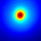
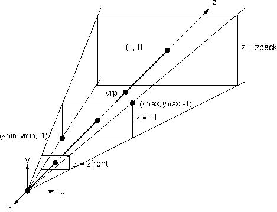
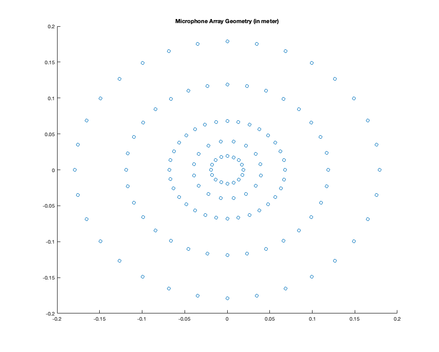
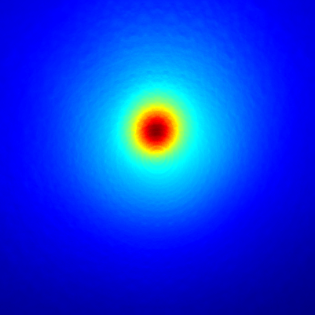

# Acoustic-Camera
A Matlab implementation of an Delay-Sum Acoustic Camera Beamformer

## Description

The Delay and Sum beamfomer implememnted with Matlab uses a virtual Projection Plane in front of the camera. The Sample Data uses a 3 second white noise signal recorded with an 128 cannel microphone array. The Dimension and Distance of the Virtual Projection Plane can be adjusted in the constances section of the matlab script.

The concept of the virtual projection plane.

The microphone array geomety.

Rendering time for one 400 x 400 image is approx 2.5h on Apple M1.

## Thanks
Thanks to [Jørgen Grythe](https://github.com/jorgengrythe/beamforming) for his RAW data for microphone array.
