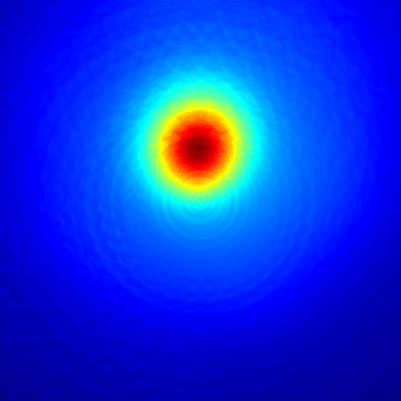
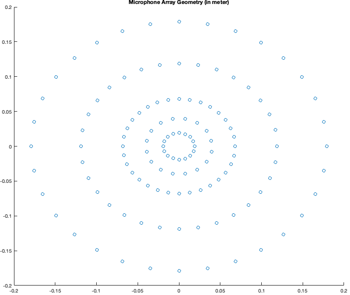
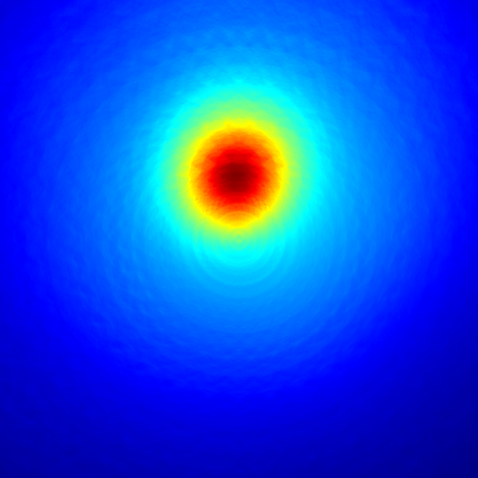
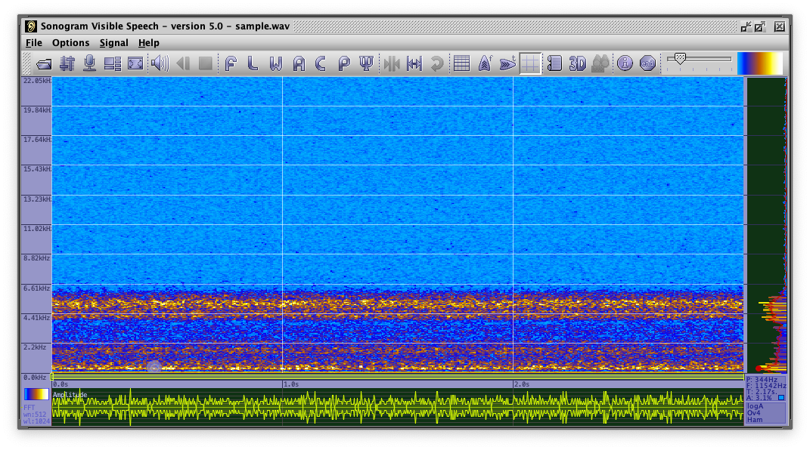
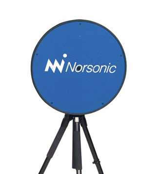

# Acoustic-Camera
A Matlab implementation of a Delay-Sum (Δ-Σ) Acoustic Camera Beamformer trough Raytracing.

## Description

The Delay and Sum beamfomer implememnted with Matlab uses a virtual Projection Plane in front of the camera. The script generates an image sequence and a video. The Sample Data uses a 3 second white noise signal recorded with an 128 cannel microphone array. The Dimension and Distance of the Virtual Projection Plane can be adjusted in the constances section of the matlab script. You need the Image Processing Toolbox and the Parallel Computing Toolbox to reproduce the images and the video. If you have no Parallel Computing Toolbox you can replace the `parfor`command with `for`.

## Concept
The matlab script is splitted into 5 parts. The main concepts used in the raytracing beamformer is the  virtual-projection-pane and the delay and sum algorithm which will be described here in more detail. In front of the microphone array a rectangle is projected with distance z. The rectangle has the width x and the height y. The main concept behind the delay and sum algorithm is the distance of the single microphones and the discrete points of the virtual-projection-plane. The projection plane is divided into discrete points with the dimension delta. The distance between the single microphones and the points in the virtual-projection-plane can be expressed in value with the unit meter and also expressed in a value with the unit samples. The disatnce in METER can be converted in SAMPLES trough the speed of sound. This means that the distance can be expressed as INDEX POINTER in the samples vector which allows a fast implementation in c-similar languages via pointers. The delay values of the microphone array can so be shifted over the virtual- projection-plane and single image points can be sampled as ray between the SUM of all (time DELAY shifted) microphones of the microphone-array. This algorithm is well known as the DELAY and SUM Algorithm (Δ-Σ). The algorithm can be found in section 3 of the source code in this script. Another concept used in the script is windowing. The time aligned sample vector is splitted into intervals of the window-length (no overlapping) and ONE image is generated for each time-window. The virtual-projection-plane is placed symetrical arround the X and Y axis in this implementation and cannot bet shifted up/down left or right. At the end of the script an movie is generated from the image sequence. To disable the parallelization replace the PARFOR command in the image main loop with FOR.

## Images

A 400x400 pixel image sequence movie.

The concept of the virtual-projection-plane.

The geometry of the microphone array.

The rendering time for the 800x800 image below is approx 5h on Apple M1 (one image per thread).

Spectrum of the input signal (generated with [Sonogram visible speech](https://github.com/Christoph-Lauer/Sonogram)).

The recordings where made with an Norsonics Nor848A microphone array.

## Thanks
Thanks to [Jørgen Grythe](https://github.com/jorgengrythe/beamforming) from Oslo/Norway for his RAW data of the microphone array.
