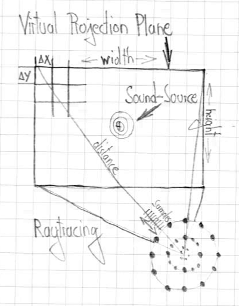

# Acoustic-Camera
A Matlab implementation of a Delay-Sum (Δ-Σ) Acoustic Camera Beamformer trough Raytracing.

## Description

The Delay and Sum beamfomer implememnted with Matlab uses a virtual Projection Plane in front of the camera. The Sample Data uses a 3 second white noise signal recorded with an 128 cannel microphone array. The Dimension and Distance of the Virtual Projection Plane can be adjusted in the constances section of the matlab script. You need the Image Processing Toolbox and the Parallel Computing Toolbox to reproduce the images and the video. If you have no Parallel Computing Toolbox you can replace the `parfor`command with `for`.

The concept of the virtual projection plane.

The geometry of the microphone array.

The rendering time for the 800x800 image below is approx 10h on Apple M1 (one image per thread).

The recordings where made with an Norsonics Nor848A.

## Thanks
Thanks to [Jørgen Grythe](https://github.com/jorgengrythe/beamforming) from Oslo/Sweden for his RAW data of the microphone array.
